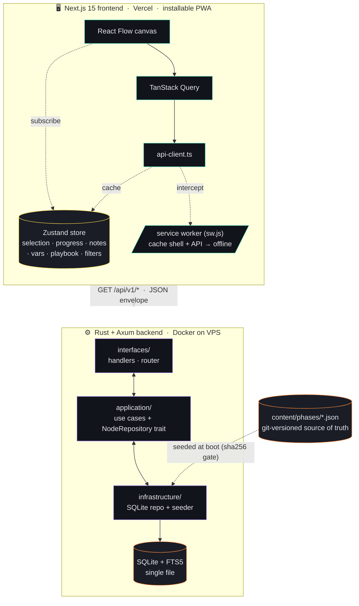

<div align="center">

# 🛡️  WindowsPE

### Interactive Windows Privilege Escalation methodology — your co‑pilot for **OSCP**, **CTFs**, and **red‑team** engagements.

<br/>

[](#-content)
[](#-content)
[](#-quality-of-life)
[](LICENSE)

[](#-tech-stack)
[](#-tech-stack)
[](#-tech-stack)
[](#-tech-stack)
[](#-tech-stack)
[](#-tech-stack)

[**🚀 Quickstart**](#-quickstart) · [**✨ Features**](#-features) · [**⌨️ Shortcuts**](#%EF%B8%8F-keyboard-shortcuts) · [**🏗️ Architecture**](#%EF%B8%8F-architecture) · [**🌐 Deploy**](#-production-deployment)

</div>

---

> [!TIP]
> **WindowsPE is opinionated:** passive reference sites already exist.
> **This one's a co‑pilot** — paste tool output and it ranks the applicable
> techniques; set LHOST/LPORT once and every command rewrites itself;
> step through a guided wizard when you're stuck. Works offline.

<div align="center">

|       226       |       14       |      ~400      |     ~300      |   PWA    |
| :-------------: | :------------: | :------------: | :-----------: | :------: |
| **techniques**  |   **phases**   |  **snippets**  | **references**| **offline** |

</div>

---

## 📑  Table of contents

<details>
<summary>Expand</summary>

- [Why WindowsPE?](#-why-windowspe)
- [Features](#-features)
  - [Co‑pilot tools](#-co-pilot-tools)
  - [The graph](#%EF%B8%8F-the-graph)
  - [Content](#-content)
  - [Quality of life](#-quality-of-life)
- [Screenshots & demo](#-screenshots--demo)
- [Keyboard shortcuts](#%EF%B8%8F-keyboard-shortcuts)
- [Architecture](#%EF%B8%8F-architecture)
- [Tech stack](#-tech-stack)
- [Repository layout](#-repository-layout)
- [Quickstart](#-quickstart)
- [Content authoring](#-content-authoring)
- [Production deployment](#-production-deployment)
- [Configuration](#%EF%B8%8F-configuration)
- [API surface](#-api-surface)
- [What's shipped (v1)](#-whats-shipped-v1)
- [Roadmap](#-roadmap)
- [Ethics & legal](#%EF%B8%8F-ethics--legal)
- [License](#-license)

</details>

---

## 💡  Why WindowsPE?

| Static reference site | **WindowsPE** |
| :--- | :--- |
| You manually edit `10.10.14.5` in every command before running it | **Set LHOST/LPORT once** — every snippet rewrites itself, copy‑paste ready |
| You stare at `whoami /priv`, then Google each privilege one by one | **Paste it** — the analyzer ranks applicable techniques in milliseconds |
| You don't know where to start on a new box | **Triage wizard** walks a decision tree to the right technique |
| You bookmark a dozen articles, then can't find them again | **Per‑node notes + progress checklist + Markdown export** |
| Works only when the network does | **Installable PWA** — fully offline once visited |
| Read‑only documentation | **Build kill‑chain playbooks**, drill **flashcards**, ship a report |

---

## ✨  Features

### 🎯  Co‑pilot tools

> The four flagship features that turn this from a wiki into a tool.

<table>
<tr>
<td width="50%" valign="top">

#### 🎯  Target context

Set `LHOST`, `LPORT`, target IP, domain, work‑dir, payload name **once** in the top bar. Every snippet — and *Copy all*, and the Markdown export — is rewritten with your values.

No more hand‑editing `10.10.14.5` in 30 places. Persists to `localStorage`.

</td>
<td width="50%" valign="top">

#### 🔎  Output analyzer  &nbsp;<kbd>A</kbd>

Paste real tool output (`whoami /priv`, winPEAS, accesschk) and the analyzer ranks applicable techniques using a curated token table (`SeImpersonatePrivilege` → Potato family, `AlwaysInstallElevated` → MSI shortcut, `cpassword` → GPP creds…) plus a derived keyword index. Click a hit → that node's detail.

</td>
</tr>
<tr>
<td width="50%" valign="top">

#### 🧭  Triage wizard  &nbsp;<kbd>W</kbd>

Stuck? Walk a decision tree:

> *"Did you enumerate? · whoami /priv shows what? · Services weak? · Stored creds? · Need a UAC bypass? · Maybe a kernel exploit?"*

Each leaf hands you the right techniques to try.

</td>
<td width="50%" valign="top">

#### 🎓  Study mode &nbsp;⚔️  Playbook builder  &nbsp;<kbd>S</kbd> <kbd>P</kbd>

Drill techniques as flashcards / quiz before the exam. Then assemble the boxes you've owned into a **kill‑chain playbook** you can export.

</td>
</tr>
</table>

Plus the classic **⌘K / Ctrl‑K command palette** — server‑side FTS5 with `<mark>`‑highlighted excerpts, **prefix matching** (`juic` finds JuicyPotato), **tag‑aware** indexing, recently‑viewed shortcuts, and quick‑actions (toggle filters, export, reset progress, open analyzer / wizard / study / playbook).

---

### 🗺️  The graph

- **Full methodology as an interactive React Flow canvas** — 226 technique cards + 14 phase anchors auto‑laid‑out with dagre; pan, zoom, click any node to slide‑in its detail panel.
- **Severity‑coloured everything** — cards, side stripes, minimap dots, detail‑panel chips all map to the same `info → low → medium → high → critical` ramp so danger reads at a glance.
- **Relationship overlay** (toggle) — show `prerequisite` (violet arrows) and `related` (cyan dashed) edges that are hidden by default, **without re‑running layout**.
- **Focus mode** — selecting a technique dims everything except its lineage (ancestors → self → direct children + phase anchor), so the attack path *pops* on a 100‑node canvas.
- **Filters with a shareable URL** — by severity, difficulty, or tag; non‑matching nodes fade back. Active filters serialise to `?sev=…&diff=…&tag=…` so you can hand a teammate a link to your exact view.
- **Phase legend** — collapsible bottom‑left panel, one row per phase with a live progress bar; click a phase to fly‑zoom the canvas to fit its nodes.

### 📚  Content

- **226 nodes across 14 phases:** Initial Enumeration · User Enumeration · Token Privileges · Automated Tools · Service Misconfigurations · Registry · Stored Credentials · Scheduled Tasks · Startup Apps · PATH/DLL Hijacking · UAC / Token Impersonation · Kernel Exploits · Defense Bypass · AD Bridge.
- **Verified, real‑world techniques only** — JuicyPotato · RoguePotato · GodPotato · SpoolFool · `SeBackup → SAM dump` · AlwaysInstallElevated · unquoted paths · SilentCleanup · fodhelper · PrintNightmare · HiveNightmare · Kerberoasting · DCSync · Golden & Silver tickets · ADCS ESC1–ESC8 · RBCD · Pass‑the‑Hash · *(and many more)*.
- **MITRE ATT&CK mapped** — every applicable technique tagged with its `T‑id`, rendered as a clickable link to `attack.mitre.org`.
- **Three‑shell snippet style** — PowerShell · CMD · Bash (and C where appropriate). Each uses **realistic placeholders** that the target‑context substitutes live.
- **Curated references per node** — HackTricks, Microsoft Docs, MITRE, CVE entries, original disclosure blogs, tool repos.
- **Detection hints** — what defenders see when this technique runs.
- **Cross‑links** — `prerequisites` and `related` resolve to actual node ids; both feed the overlay and the side‑panel chips.

### 🧰  Quality of life

| | |
| :--- | :--- |
| 🗒️ &nbsp; **Per‑node notes** — private scratchpad, debounced auto‑save, flows into the export | 📋 &nbsp; **Progress tracker** — done / skipped, top‑bar counts, ratio bar |
| 📥 &nbsp; **Markdown export** — checklist + notes grouped by phase, OSCP / Obsidian ready | 🕒 &nbsp; **Recently viewed** — palette remembers the last 8 nodes |
| 🎹 &nbsp; **Full keyboard control** — see [shortcuts](#%EF%B8%8F-keyboard-shortcuts) | 📲 &nbsp; **Installable PWA** — works on the plane, in the exam VM, on flaky Wi‑Fi |
| ♿️ &nbsp; **Accessible** — focus rings, ARIA, `prefers-reduced-motion` respected | ⚡️ &nbsp; **Fast** — self‑hosted fonts, HTTP `ETag`, memoised layout |
| 🎨 &nbsp; **Premium dark mode** — hairline borders, cyan/violet accents, film‑grain canvas | 🔗 &nbsp; **Deep‑linkable** — share `/node/svc-unquoted-path` with a teammate |

---

## 🖼️  Screenshots & demo

> [!NOTE]
> Screenshots and a live demo URL land here. Recommended shots: full canvas,
> detail panel with snippets, output analyzer, triage wizard, ⌘K palette.
> Drop them in `docs/img/` and link them in this section.

**Live demo:** _coming soon — add your Vercel URL here once deployed._

---

## ⌨️  Keyboard shortcuts

<div align="center">

| Key | Action |
| :---: | :--- |
| <kbd>⌘</kbd> <kbd>K</kbd> &nbsp;/&nbsp; <kbd>Ctrl</kbd> <kbd>K</kbd> | Open command palette (search + quick actions) |
| <kbd>/</kbd> | Open command palette |
| <kbd>A</kbd> | Open output analyzer |
| <kbd>W</kbd> | Open triage wizard |
| <kbd>S</kbd> | Open study mode |
| <kbd>P</kbd> | Open playbook builder |
| <kbd>F</kbd> | Toggle canvas filters |
| <kbd>E</kbd> | Export checklist + notes as Markdown |
| <kbd>?</kbd> | Show keyboard shortcuts |
| <kbd>Esc</kbd> | Close active panel / dialog |
| <kbd>Enter</kbd> &nbsp;/&nbsp; <kbd>Space</kbd> | Open focused node on the canvas |

</div>

> [!TIP]
> Press <kbd>?</kbd> inside the app to see this list in‑context.

---

## 🏗️  Architecture



**Pragmatic layered architecture** — `domain → application → infrastructure → interfaces`. The domain is framework‑free. Persistence sits behind a `NodeRepository` trait so swapping SQLite → Postgres later is a single new file. Content is git‑versioned JSON; the DB is a derived index, seeded on boot via a sha256‑gated, idempotent reseeder.

<details>
<summary>Plain‑ASCII version (fallback)</summary>

```
┌─────────────────────────────────────────────────────────────┐
│  Next.js 15 frontend  (Vercel · installable PWA)            │
│   React Flow → TanStack Query → api-client → Zustand store  │
│              + service worker (offline cache)               │
└──────────────────────────────┬──────────────────────────────┘
                               │  GET /api/v1/*  (JSON envelope)
┌──────────────────────────────┴──────────────────────────────┐
│  Rust / Axum backend  (Docker on VPS)                       │
│   interfaces/handlers ←→ application/ ←→ infrastructure/    │
│                                       SQLite + FTS5         │
└──────────────────────────────┬──────────────────────────────┘
                               ↑ seeded at boot from content/phases/*.json
```

</details>

---

## 🧱  Tech stack

<div align="center">

| Layer | Choice |
| :--- | :--- |
| **Backend** | Rust 1.78+ · Axum 0.7 · SQLx 0.8 · Tokio · tracing · Moka cache |
| **Database** | SQLite 3.38+ with FTS5 (zero‑ops; behind a `NodeRepository` trait) |
| **Frontend** | Next.js 15 (App Router) · React 19 · TanStack Query 5 · Zustand 5 |
| **Graph viz** | React Flow (`@xyflow/react`) v12 · dagre auto‑layout |
| **Styling** | Tailwind CSS v4 (CSS‑first `@theme`) · shadcn‑style primitives over Radix UI |
| **Code rendering** | Shiki (VS Code grammar) |
| **Search palette** | `cmdk` + backend FTS5 (prefix + tag‑indexed) |
| **Animation** | Framer Motion |
| **PWA** | Hand‑rolled service worker + Web App Manifest (no `next-pwa`) |
| **Fonts** | Self‑hosted Geist + JetBrains Mono via `next/font` |
| **Content** | Git‑versioned JSON validated by JSON Schema (Draft 2020‑12) |
| **Hosting** | Frontend on Vercel · backend Docker on any VPS |

</div>

---

## 📂  Repository layout

<details>
<summary>Full tree</summary>

```
WindowsPE/
├── backend/                   Rust + Axum API
│   ├── src/
│   │   ├── domain/            pure entities — no I/O, no framework deps
│   │   ├── application/       use cases + NodeRepository trait
│   │   ├── infrastructure/    SQLite repo + content seeder
│   │   └── interfaces/        handlers, router, DTOs
│   ├── migrations/            SQLx migrations (FTS5 setup)
│   ├── Cargo.toml
│   └── Dockerfile
│
├── frontend/                  Next.js 15 (App Router · PWA)
│   ├── public/                icons, manifest, sw.js
│   └── src/
│       ├── app/               root layout, /, /node/[id], manifest.ts
│       ├── components/
│       │   ├── tree/          MethodologyCanvas, PhaseNode,
│       │   │                  TechniqueNode, FilterBar, PhaseLegend
│       │   ├── panel/         NodeDetailPanel, SnippetBlock, NoteEditor…
│       │   ├── layout/        TopBar, CommandPalette, TargetContext,
│       │   │                  OutputAnalyzer, TriageWizard, StudyMode,
│       │   │                  PlaybookBuilder, ShortcutsHelp,
│       │   │                  ServiceWorkerRegister, ToolButtons…
│       │   └── ui/            Sheet (Radix + Framer)
│       ├── features/
│       │   ├── methodology/   hooks, store, types, match, export
│       │   └── snippets/      Shiki singleton, clipboard, substitute
│       └── lib/               api-client, layout-engine, mitre, utils
│
├── content/                   Methodology content (source of truth)
│   ├── methodology.json       master index (14 phases)
│   ├── phases/*.json          14 phase files · 226 nodes total
│   ├── schema/                JSON Schema (Draft 2020‑12)
│   └── SCHEMA.md              contributor guide
│
├── docker-compose.yml         backend deployment
├── ENVIRONMENT.md             env‑var reference
├── LICENSE                    MIT
└── README.md
```

</details>

---

## 🚀  Quickstart

### Backend

> **Prerequisites:** Rust 1.78+ (`rustup` recommended).

```bash
cd backend
cp .env.example .env
cargo run
```

First boot does this automatically:

1. Creates `windowspe.db` next to the binary.
2. Applies migrations (`0001_init.sql`, `0002_seed_meta.sql`).
3. Reads `../content/` and seeds the database in a single transaction (idempotent — re‑running with unchanged content is a no‑op).
4. Listens on `127.0.0.1:8080`.

Sanity check:

```bash
curl -s http://localhost:8080/api/v1/health | jq
# → { "data": { "status": "ok", "methodology_version": "1.1.0" }, "error": null }
```

### Frontend

> **Prerequisites:** Node 20.11+.

```bash
cd frontend
cp .env.example .env.local
npm install
npm run dev
```

Visit **http://localhost:3000**. The frontend talks to the backend via `NEXT_PUBLIC_API_BASE_URL` (default `http://localhost:8080/api/v1`).

> [!NOTE]
> The service worker / PWA install only activate in **production** builds
> (`npm run build && npm start`). Dev mode skips them on purpose to keep
> HMR clean.

---

## 📝  Content authoring

Methodology content lives in **`content/phases/*.json`** and is the canonical source of truth — the DB is a derived index, seeded on backend boot (idempotent via sha256 hash gate).

See **[`content/SCHEMA.md`](content/SCHEMA.md)** for slug conventions, severity / difficulty rubrics, snippet style, and how to add a new phase. JSON Schema validation lives in `content/schema/methodology.schema.json`.

To add a technique to an existing phase: open the phase file, append a node, restart the backend — the seeder picks it up automatically.

<details>
<summary>Pre‑boot validator (Python one‑liner)</summary>

```bash
python3 -c "
import json, glob
from jsonschema import Draft202012Validator
schema = json.load(open('content/schema/methodology.schema.json'))
v = Draft202012Validator(schema)
for f in sorted(glob.glob('content/phases/*.json')):
    errs = list(v.iter_errors(json.load(open(f))))
    print(f, 'OK' if not errs else errs[0].message)
"
```

</details>

---

## 🌐  Production deployment

### Backend → Docker on a VPS

The repo ships a multi‑stage `backend/Dockerfile` (cargo‑chef for dep caching, `debian-slim` runtime, non‑root user, baked‑in content, healthcheck) and a `docker-compose.yml` that wires it up with a named volume for the SQLite file.

```bash
# On the VPS
git clone https://github.com/<you>/WindowsPE.git
cd WindowsPE

# Edit the CORS allowlist to include your Vercel URL
$EDITOR docker-compose.yml      # WINDOWSPE_CORS_ORIGINS

docker compose up -d --build
docker compose logs -f backend
```

The compose file publishes the backend on **host port `127.0.0.1:8084`** (container still listens on 8080 internally — adjust to taste). SQLite data persists to the named volume `windowspe_data`. Healthcheck hits `/api/v1/health` every 30s.

Put a TLS‑terminating reverse proxy in front. Example **Caddyfile**:

```caddy
api.example.com {
    reverse_proxy localhost:8084
}
```

(Caddy auto‑provisions Let's Encrypt certs.)

### Frontend → Vercel

1. Push this repo to GitHub.
2. Import into Vercel → **Root Directory: `frontend`**.
3. Add env var: `NEXT_PUBLIC_API_BASE_URL=https://api.example.com/api/v1`.
4. Update `WINDOWSPE_CORS_ORIGINS` on the backend to include your `https://*.vercel.app` URL.

Next.js's auto‑detect handles everything else (build command, output dir, framework preset).

---

## ⚙️  Configuration

All backend configuration is environment‑driven (`WINDOWSPE_*` prefix). See **[`ENVIRONMENT.md`](ENVIRONMENT.md)** and `backend/.env.example` for the full reference. Headline knobs:

| Variable | Default | Description |
|----------|---------|-------------|
| `WINDOWSPE_BIND_ADDR` | `127.0.0.1:8080` | Listening socket inside the process |
| `WINDOWSPE_DATABASE_URL` | `sqlite://./windowspe.db?mode=rwc` | SQLx connection URL |
| `WINDOWSPE_CONTENT_DIR` | `../content` | Path to content tree |
| `WINDOWSPE_CORS_ORIGINS` | `http://localhost:3000` | Comma‑separated origin allowlist (fail‑closed) |
| `WINDOWSPE_CACHE_TTL_SECS` | `300` | Methodology in‑memory cache TTL |
| `WINDOWSPE_LOG_LEVEL` | `info` | `tracing-subscriber` env‑filter directive |

> [!WARNING]
> **CORS is fail‑closed.** Empty or wrong `WINDOWSPE_CORS_ORIGINS` →
> all cross‑origin requests rejected. There is no `AllowOrigin::any()`
> fallback.

Frontend has exactly one env var: `NEXT_PUBLIC_API_BASE_URL`.

---

## 🛰️  API surface

All endpoints under `/api/v1`. Uniform `{ data, error }` envelope.

| Method | Path | Returns |
|--------|------|---------|
| `GET` | `/health` | `{ status, methodology_version }` |
| `GET` | `/methodology` | Full graph (phases + node summaries + edges). ETag‑cached. |
| `GET` | `/nodes/:id` | Single node detail with snippets, references, prerequisites, related |
| `GET` | `/search?q=&limit=` | FTS5 hits (prefix + tag‑indexed) with `<mark>`‑highlighted excerpts |

The Rust DTOs in `backend/src/interfaces/dto/` are mirrored 1:1 by `frontend/src/features/methodology/types.ts` — the single source of truth for the API contract on the frontend.

---

## ✅  What's shipped (v1)

<details>
<summary>The full list</summary>

- **226 techniques × 14 phases**, ~400 snippets, ~300 references, MITRE ATT&CK mapped where applicable
- Interactive React Flow canvas with dagre auto‑layout, severity‑coloured minimap, phase legend with progress + fit‑view
- Filters (severity / difficulty / tag) **synced to the URL** so views are shareable
- Relationship overlay (prerequisite + related) toggleable, drawn after layout
- Focus mode dimming non‑lineage nodes when one is selected
- Sliding side panel: phase breadcrumb, prev / next within phase, severity stripe, difficulty + tags, Description (Markdown + GFM), Commands, Detection, References, Cross‑links, **Notes**, Progress controls
- ⌘K command palette over FTS5 (prefix + tag indexing), recently viewed, quick actions
- **Target context** — LHOST/LPORT/target/domain/work‑dir/payload substituted into every snippet & export
- **Output analyzer** — paste tool output, get ranked applicable techniques with match reasons
- **Triage wizard** — guided decision tree routing you to the right node
- **Study mode** — flashcard / quiz drilling
- **Playbook builder** — assemble a kill‑chain across techniques and export
- Per‑node Notes (localStorage, fed into export)
- Markdown export of the full checklist + notes
- Deep‑linkable `/node/[id]` URLs
- Self‑hosted Geist + JetBrains Mono via `next/font` (zero CDN runtime)
- HTTP `ETag` / `Cache-Control` honoured by the API client
- Reduced‑motion respected
- Installable PWA + hand‑rolled service worker (offline shell + API responses)
- Keyboard‑accessible canvas, focus‑visible accent rings, ARIA throughout
- Mobile single‑column layout + collapsible top‑bar tools

</details>

---

## 🛣️  Roadmap

Shipped — see above. **Open:**

- [ ] Auth + cloud sync of progress / notes / playbooks (multi‑device study)
- [ ] OpenAPI schema generation via `utoipa` + auto‑generated TS client
- [ ] Sibling‑walk via keyboard arrows directly on the canvas
- [ ] Atomic Red Team / Sigma rule cross‑references in detection hints
- [ ] Reverse‑shell / payload generator (revshells.com‑style, fed from the target context)
- [ ] Deeper Active Directory module (cert services chains, AD CS ESC1–ESC11, BloodHound integration ideas)

> [!TIP]
> **PRs welcome.** New techniques follow [`content/SCHEMA.md`](content/SCHEMA.md);
> UI changes should stay within the existing token system in `globals.css`.

---

## ⚖️  Ethics & legal

> [!IMPORTANT]
> This content is for **authorised security testing, CTF practice, and
> education only**. Every technique here is publicly documented (HackTricks,
> MITRE ATT&CK, Microsoft docs, original disclosure blogs and CVEs).
> Use against systems you don't own or aren't explicitly authorised to
> test is illegal and unethical.

The maintainers accept no liability for misuse.

---

## 📄  License

[**MIT**](LICENSE) © WindowsPE contributors.

---

<div align="center">

Built with **Rust** · **Axum** · **SQLx** · **SQLite + FTS5** · **Next.js 15** · **React 19** · **React Flow** · **Shiki** · **Tailwind v4** · **Radix UI** · **Framer Motion** · **cmdk**

<sub>⭐ &nbsp;If WindowsPE saved you time on a box, give the repo a star.</sub>

</div>
